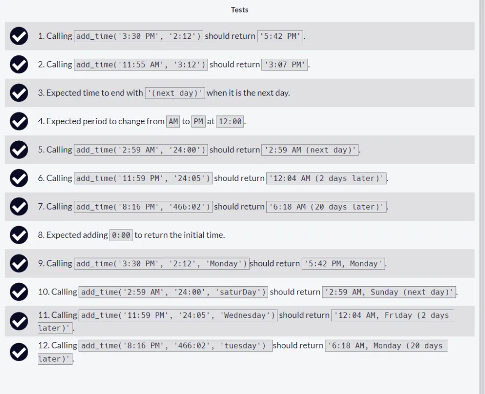

# Build a Time Calculator Project

Repositorio con el código solución al [segundo proyecto requisito obligatorio](https://www.freecodecamp.org/learn/scientific-computing-with-python/build-a-time-calculator-project/build-a-time-calculator-project) para obtener la [Freecodecamp Scientific Computing with Python Certification](https://www.freecodecamp.org/learn/scientific-computing-with-python/)

## Tabla de Contenidos

- [Build a Time Calculator Project](#build-a-time-calculator-project)
  - [Tabla de Contenidos](#tabla-de-contenidos)
  - [Approved Project](#approved-project)
  - [Instructions](#instructions)
  - [All tests passed](#all-tests-passed)
  - [Code](#code)

## Approved Project


## Instructions


## All tests passed



## Code

```py
def convert_24hours_to_12hours(hour:int,minutes:int):
    if hour>12:
        hour = hour-12
        period = 'PM'
    elif hour==12:
        period = 'PM'
    else:
        period = 'AM'
        if hour==0:
            hour = 12
    return f'{str(hour)}:{str(minutes).zfill(2)} {period}'


def add_time(start, duration,day_of_week = ""):

    time,period = start.split()
    hour,minute = time.split(':')

    if period=='PM' and hour!='12':
        hour=str(int(hour)+12)

    total_minutes = int(hour)*60+int(minute)+int(duration.split(':')[0])*60+int(duration.split(':')[1])
    total_days = total_minutes//(24*60)
    total_minutes = total_minutes%(24*60)
    hour = total_minutes//60
    minute = total_minutes%60
    days_of_week = ['monday','tuesday','wednesday','thursday','friday','saturday','sunday']

    time_converted=convert_24hours_to_12hours(hour,minute)

    if day_of_week=='':
        if total_days==0:
            return time_converted
        elif total_days==1:
            return time_converted +' (next day)'
        else:
            return time_converted +' ('+str(total_days)+' days later)'
    else:
        day_of_week=day_of_week.lower()
        if total_days==0:
            return time_converted +', '+day_of_week.lower().capitalize()
        else:

            current_day = days_of_week.index(day_of_week)
            next_day = days_of_week[(current_day+total_days)%7].capitalize()

            if total_days==1:
                return time_converted +', '+next_day+' (next day)'
            else:
                return time_converted +', '+next_day+' ('+str(total_days)+' days later)'
```
